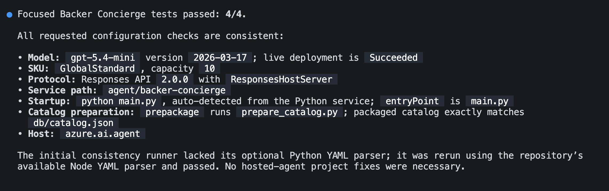
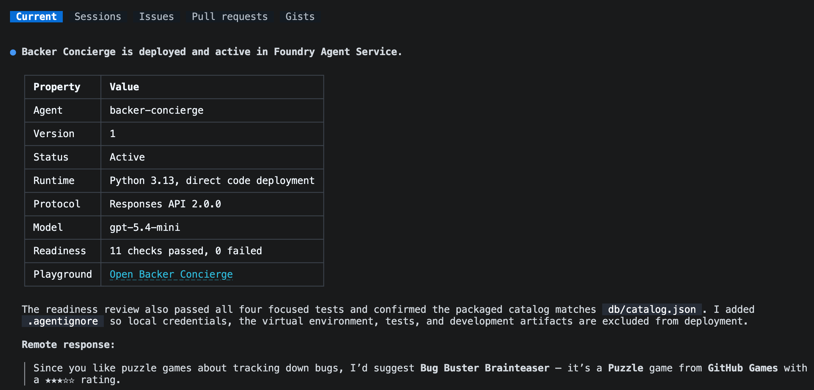

En el [módulo 1][previous-lesson], preparaste el catálogo y probaste un modelo desplegado. Este segundo módulo de la [serie opcional del concierge][overview] convierte esa base en un agente hospedado.

En este módulo:

- generarás la estructura del agente con su propia copia del catálogo lista para desplegar.
- comprobarás en local que las respuestas se fundamentan en el catálogo y que se mantiene la continuidad de la conversación.
- desplegarás el agente y lo invocarás de forma remota.

## Escenario

Tailspin Toys necesita algo más que una respuesta aislada de un modelo. Quienes apoyan los juegos esperan que el concierge recuerde los que acaba de recomendar y responda a preguntas de seguimiento sobre ellos. El equipo también necesita que esas respuestas sigan siendo fiables cuando el concierge pase del equipo de un desarrollador a un servicio hospedado.

## Continúa con tu proyecto

Este módulo parte del modelo funcional del módulo 1. Mantendrás el mismo proyecto y despliegue en lugar de crear otro conjunto de recursos de Azure.

1. Vuelve al repositorio de Tailspin Toys en la rama `foundry-agent-cli` y a la sesión de Copilot CLI del módulo 1.
2. Confirma que `db/catalog.json` está disponible y que conservas el proyecto de Foundry, el despliegue del modelo seleccionado y la sesión de Azure que usaste para probar el modelo. Si no has completado esa configuración, termina primero [Prepara el proyecto y el modelo][previous-lesson].

> [!IMPORTANT]
> Los agentes hospedados están en versión preliminar pública y crean recursos facturables de Azure. Las [instrucciones de limpieza][cleanup] se aplican si paras después de este módulo.

## Genera la estructura del agente Backer Concierge

Ahora pedirás a la habilidad Microsoft Foundry que genere la estructura del agente hospedado dentro del repositorio existente de Tailspin Toys y, después, inspeccionarás su empaquetado y configuración antes de ejecutarlo.

1. Introduce el siguiente prompt en Copilot CLI:

    ```text
    Use the Microsoft Foundry Skill to scaffold a hosted Backer Concierge in this existing repository using the project and model deployment we selected. Start from the Python 3.13 Basic hosted-agent sample, use Microsoft Agent Framework with the Responses API and code deployment, and keep the agent in agent/backer-concierge. Keep one azure.yaml at the repository root with a service using host: azure.ai.agent.

    Ground every answer in db/catalog.json. Never invent games, publishers, ratings, funding totals, backer counts, pledge tiers, prices, player counts, play times, or release dates. Ask one short clarifying question when a request is vague and preserve conversation context. Ensure the catalog is copied into the deployable service during preparation so the deployed agent never depends on a file outside its service directory. Add focused tests for catalog loading and grounding behavior.

    Scaffold and test locally, but do not deploy the hosted agent yet. Stop and ask me to authenticate if needed.
    ```

2. Sigue la sesión para responder a las preguntas sobre el proyecto de Foundry, el despliegue del modelo, el nombre del agente o el entorno.
3. Cuando Copilot termine, inspecciona los cambios:

    ```text
    /diff
    ```

    Confirma que:

    - `azure.yaml` contiene un servicio con `host: azure.ai.agent`.
    - el servicio apunta a `agent/backer-concierge`.
    - el paquete del servicio desplegado incluye su propia copia generada del catálogo.
    - un script o paso de compilación actualiza esa copia desde `db/catalog.json`, en lugar de mantener dos catálogos editados a mano.
    - el agente usa el despliegue del modelo seleccionado y la API Responses.
    - las instrucciones rechazan explícitamente los datos que no aparecen en el catálogo.
    - no hay credenciales, tokens de acceso, archivos `.env` ni archivos de entorno de `.azure` preparados para incluirse en un commit.

    Usa la siguiente estructura como punto de comprobación tras generar la estructura del agente:

    ```text
    tailspin-toys/
    ├── azure.yaml
    ├── agent/
    │   └── backer-concierge/
    │       ├── catalog.json
    │       └── requirements.txt
    ├── db/
    │   └── catalog.json
    └── src/
    ```

> [!IMPORTANT]
> `azd deploy` empaqueta el directorio del servicio del agente hospedado. Una referencia en tiempo de ejecución desde `agent/backer-concierge` a `db/catalog.json`, situado en la raíz del repositorio, puede funcionar en local y fallar después del despliegue. La copia generada debe estar disponible en el directorio `agent/backer-concierge/` antes del despliegue.

4. Pide a Copilot que ejecute las pruebas específicas e inspeccione la configuración generada antes de iniciar el servicio:

    ```text
    Run the focused Backer Concierge tests. Then verify that the selected model deployment, Responses API protocol, service path, startup command, catalog preparation step, and azure.ai.agent host configuration are consistent. Fix only problems in this hosted-agent project and rerun the failed checks.
    ```

    No continúes hasta que las pruebas específicas se superen.

    

## Prueba el agente en local

Ahora comprobarás, mediante la API Responses local del agente, que sus respuestas se fundamentan en el catálogo y que su comportamiento conversacional es correcto. El servicio del agente local ocupa el terminal mientras se ejecuta, así que mantendrás Copilot CLI abierto en el terminal actual e iniciarás el agente desde un segundo terminal.

1. Abre otro terminal pulsando <kbd>Ctrl</kbd>+<kbd>\`</kbd>.
2. Desde la raíz del repositorio de Tailspin Toys, ejecuta:

    ```bash
    azd ai agent run
    ```

    La primera ejecución local crea un entorno de Python, instala las dependencias e inicia el agente hospedado. Deja este terminal en ejecución.

3. Vuelve a Copilot CLI en el primer terminal e introduce:

    ```text
    Test the running Backer Concierge through its Responses API. Run each acceptance prompt below, preserve the response ID for the two-turn conversation test, and compare every response with the expected behavior. Show a concise pass or fail table and the evidence for any failure. Do not change code yet.

    1. "I love puzzle games about tracking down bugs. What should I back?" Expected: only real catalog titles with correct details.
    2. "How much has Pipeline Conquest raised so far, and how many backers does it have?" Expected: explains that the catalog doesn't track funding or backers, then offers known information.
    3. "I need something for four players, about an hour long." Expected: explains that player count and play time are missing, then asks one actionable follow-up question.
    4. "Do you have Wingspan? If not, what's the closest thing you've got?" Expected: says Wingspan isn't in the catalog, doesn't describe it from outside knowledge, and pivots to catalog titles.
    5. "Recommend me something good." Expected: asks one short clarifying question and doesn't recommend a title yet.
    6. "What are your three highest rated games?" Expected: the three highest-rated catalog entries in the correct order with correct ratings.
    7. In one conversation, send "Show me two highly rated strategy games." followed by "Which of those has the higher rating?" Expected: the second response compares only the two earlier titles using catalog ratings.
    ```

    

4. Revisa los resultados. Si el agente no puede conectarse, confirma que el segundo terminal sigue ejecutando el servicio. Si falla una prueba, pide a Copilot que corrija solo el defecto local, ejecute las pruebas específicas y te indique cuándo reiniciar `azd ai agent run`. Reinicia el servicio y repite la prueba de aceptación fallida después de cada cambio.

## Despliega el agente hospedado

Una vez superadas las pruebas de aceptación locales, puedes desplegar el agente en Microsoft Foundry. Usarás el mismo flujo guiado por la habilidad para comprobar que todo está listo para el despliegue y probar el punto de conexión remoto.

1. Detén el servicio local con <kbd>Ctrl</kbd>+<kbd>C</kbd> cuando se hayan superado todas las pruebas de aceptación.
2. Vuelve a Copilot CLI e introduce el siguiente prompt. Revisa los recursos propuestos y el coste estimado antes de aprobar el despliegue:

    ```text
    Continue with the Microsoft Foundry Skill workflow. Review the hosted agent for deployment readiness, then deploy it to Microsoft Foundry, show the deployment status and playground link, and invoke it remotely with: "I love puzzle games about tracking down bugs. What should I back?"
    ```

3. Si se te pide que selecciones el origen de una batería de evaluación, elige **No, set it up later**.

    

4. Revisa el estado del despliegue y la respuesta remota. Confirma que el agente está en ejecución y recomienda únicamente juegos reales del catálogo. Si el despliegue o la invocación fallan, pide a Copilot que diagnostique el fallo y repita la prueba remota antes de continuar.

El enlace al área de pruebas que se muestra te permite interactuar con el agente hospedado desplegado en el portal de Microsoft Foundry.

El flujo guiado por la habilidad usa `azd deploy` para empaquetar el código fuente del servicio, resolver las dependencias, compilarlo de forma remota y publicarlo en Microsoft Foundry. Usa el flujo de invocación de Foundry para probar el punto de conexión desplegado.

## Resumen y siguientes pasos

Has generado la estructura de un agente con una copia del catálogo lista para desplegar, probado que las respuestas se fundamentan en el catálogo y que la conversación mantiene la continuidad, y verificado una respuesta remota de Microsoft Foundry. Ahora tienes un Backer Concierge hospedado y funcional.

A continuación, mantendrás el mismo repositorio, la misma rama, la misma sesión de Copilot CLI y el agente desplegado para [conectar el concierge al sitio web][next-lesson]. Si un agente hospedado es suficiente para lo que quieres explorar, puedes parar aquí y [eliminar los recursos de Azure][cleanup].

[overview]: ../
[previous-lesson]: ../1-project-and-model/
[next-lesson]: ../3-connect-to-site/
[cleanup]: ../#elimina-los-recursos
