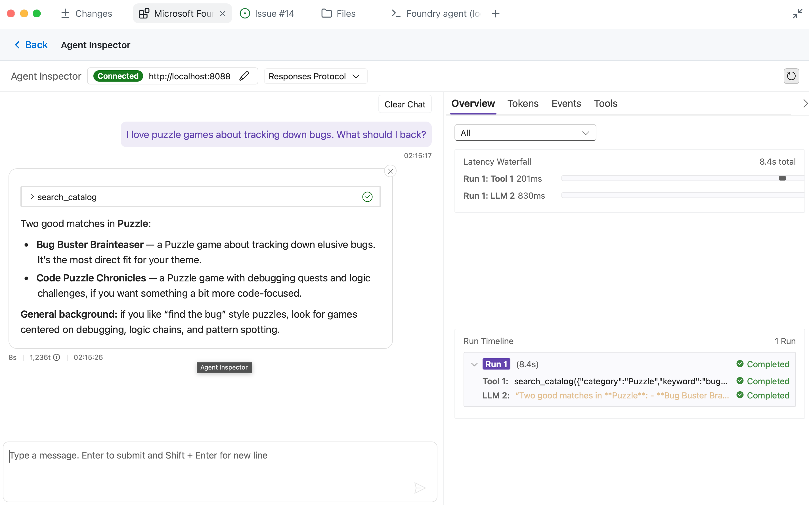

このモジュールでは、[プロジェクトとモデルを準備する][previous-module]で用意したプロジェクト、モデルデプロイ、カタログを使い、Microsoft Foundry Canvas でホステッド エージェントの Backer Concierge を構築します。

このモジュールを終えると、次のものが揃います。

- カタログデータをパッケージに含み、対象を絞ったテストを備えたエージェントのひな形。
- カタログと会話に関する各受け入れ条件を満たす、ローカルでの検証の証拠。
- Foundry にデプロイして再テストしたエージェントのバージョン。

## シナリオ

Tailspin Toys には、実際のカタログに関する質問に答え、情報が不足していればそれを認め、会話で取り上げたゲームを覚えているコンシェルジュが必要です。サイトに組み込む前に、サービスが信頼できることを確かめる必要があります。

## デプロイ用ツールを準備する

ホステッド エージェントの検証とデプロイでは、Canvas を通じて Azure Developer CLI を使用します。既存の Foundry プロジェクトとモデルを再利用します。

1. モジュール 1 の **Add a Backer Concierge assistant for catalog questions** Issue にリンクされた同じセッションを再開します。`db/catalog.json` が維持され、正しいサブスクリプションと Foundry プロジェクトに接続し、モデルデプロイが残っていることを確認します。リソースをクリーンアップした場合は、まず該当する[プロジェクトとモデルのセットアップ][previous-module]を繰り返してください。

2. **+**、**Terminal** の順に選択し、Azure Developer CLI にサインインします。求められたら、ブラウザーで認証を完了します。

   ```bash
   azd auth login
   ```

3. `azd config show` を実行し、Azure サブスクリプションを確認します。空の場合や誤っている場合は、`azd config set defaults.subscription <subscription-id>` で更新し、`azd config show` を再実行して変更を確認します。
## Backer Concierge のひな形を作成する

Canvas は、Backer Concierge を既存のモデルデプロイに接続するためのコード、フォルダー構造、ルートの `azure.yaml` のひな形を作成します。

4. **Create new hosted agents** プレビューで、次を入力します。

   ```plaintext
   Scaffold a hosted agent named Backer Concierge in agent/backer-concierge, connected to the tailspin-toys project and the model deployment I just confirmed. Use Microsoft Agent Framework with the Responses API. Ground it in db/catalog.json and ensure it meets the acceptance criteria in this issue. Keep a single azure.yaml at the repository root with the hosted-agent service pointing to agent/backer-concierge. Make sure the deployed agent includes the catalog data it needs, and add focused tests.
   ```

   Canvas は、プロンプトと現在のサブスクリプションおよび Foundry プロジェクトのコンテキストを Copilot に送信します。Agent Framework + Responses API のサンプルを探すため、**Agent with Local Tools (Responses, Agent Framework, Python)** などの選択肢が表示される場合があります。

   

5. **Files** タブで Copilot の変更を確認し、次のチェックポイントと照合します。`src` 内に生成されるファイル名は異なる場合がありますが、プロジェクトの構成範囲と `azure.yaml` の場所は一致するはずです。

   - エージェントが `agent/backer-concierge` にあります。
   - リポジトリのルートに `azure.yaml` が 1 つあり、`host: azure.ai.agent` を指定したサービスが含まれています。
   - デプロイ可能なエージェントに、生成された専用のカタログのコピーが含まれています。
   - 対象を絞ったテストで、カタログのグラウンディング要件を検証します。
   - 資格情報やローカル環境ファイルは含まれていません。

   ```text
   tailspin-toys/
   ├── azure.yaml
   ├── agent/
   │   └── backer-concierge/
   │       └── requirements.txt
   ├── db/
   │   └── catalog.json
   └── src/
   ```

6. Copilot に対象を絞ったテストの実行と、失敗した箇所の修正を依頼してから、**Deploy and test** に進みます。

## エージェントをローカルで検証する

**Inspect Locally** は、Copilot の統合ターミナルで `azd ai agent run` を実行し、ホステッド エージェントの起動を待って、埋め込みの Agent Inspector を開きます。

7. **Deploy and test** で **Inspect Locally** を選択し、Agent Inspector が開くまで待ちます。

> [!NOTE]
> 初回のローカル実行では、`azd` が環境を作成して依存関係をインストールするため、数分かかる場合があります。

8. Inspector が接続できない場合は、必要なポートをほかのプロセスが使用していないことを確認し、エラーを Copilot に送ります。問題を修正したら再試行します。
9. Agent Inspector で、**カタログに基づく推奨**をテストします。

    ```text
    I love puzzle games about tracking down bugs. What should I back?
    ```

    期待される結果: カタログに実在するタイトルだけを挙げ、それぞれの正しい情報を使用します。

    

10. **ハルシネーションを誘う質問**をテストします。

    ```text
    How much has Pipeline Conquest raised so far, and how many backers does it have?
    ```

    期待される結果: カタログには資金調達額や支援者数が記録されていないと説明し、代わりに記載されている情報を提供します。

11. **カタログ外の情報を求める質問**をテストします。

    ```text
    Do you have Wingspan? If not, what's the closest thing you've got?
    ```

    期待される結果: Wingspan はカタログにないと伝え、外部知識からその説明をせず、実在する Tailspin のタイトルの案内に切り替えます。

12. **曖昧な依頼**をテストします。

    ```text
    Recommend me something good.
    ```

    期待される結果: 確認のための短い質問を 1 つ返し、まだタイトルを勧めません。

13. **ランキングの正確性**をテストします。

    ```text
    What are your three highest rated games?
    ```

    期待される結果: カタログで評価が最も高い 3 つのエントリを、正しい順序と評価で返します。

14. 同じ会話で次のプロンプトを送信し、**会話の継続性**をテストします。

    ```text
    Show me two highly rated strategy games.
    ```

    ```text
    Which of those has the higher rating?
    ```

    期待される結果: 2 回目の応答では、最初の応答にあった 2 つのタイトルだけを参照し、カタログの評価を正しく比較します。

15. すべての応答を `db/catalog.json` と Issue の受け入れ条件に照らして確認します。エージェントがゲーム、パブリッシャー、評価、資金調達総額、支援者数、価格、プレイヤー数、プレイ時間、発売日を一切捏造しないことを確認してください。Agent Inspector がエラーを報告した場合や、応答がグラウンディングの範囲を超えた場合は、結果を Canvas のプロンプト領域にコピーし、Copilot に修正を依頼します。変更するたびにローカル検証を再起動して失敗したテストを再実行し、デプロイ前に 6 つのチェックすべてに合格することを確認します。

## ホステッド エージェントをデプロイして再テストする

Canvas は `azd` を使ってテスト済みのエージェントをデプロイします。Foundry はサービスのソースをパッケージ化し、依存関係を解決してリモートでビルドし、Microsoft Foundry に公開します。

16. Canvas の **Deploy and test** で **Deploy to Foundry** を選択します。チャットに挿入されるプロンプトを確認します。

    

17. デプロイの完了通知、エージェントのバージョン、ステータス、Foundry のエージェントプレイグラウンドへのリンクを確認します。デプロイが失敗した場合は、エラーを Copilot に送り、同じプロジェクトで解決してから Canvas で再試行します。
18. Canvas で **Test in Foundry Portal** を選択し、デプロイしたエージェントのプレイグラウンドを開きます。このデプロイ済みバージョンに対して、手順 9～14 の 6 つの受け入れチェックをすべて再実行します。継続性を確認する 2 つのプロンプトは、同じ会話で送信してください。応答をカタログと照合し、いずれかのチェックに失敗した場合は、Copilot に修正を依頼してローカルテストを再実行し、Canvas で再デプロイして、ホストされたバージョンを再テストします。

## チェックポイントと次のステップ

Backer Concierge のひな形を作成し、カタログのグラウンディングと会話の動作をローカルでテストして、Microsoft Foundry にデプロイし、ホステッド バージョンを再テストしました。このモジュールのチェックポイントは、不足している情報を捏造せず、6 つの受け入れチェックすべてに合格するホステッド エージェントです。

次は、同じ Tailspin Toys リポジトリ、worktree ブランチ、Issue にリンクされたセッション、Foundry プロジェクト、選択したモデルデプロイ、ホステッド エージェントを使用して、[エージェントをサイトに接続します][next-module]。ここで中断する場合は、継続的なコストを避けるために[Azure リソースをクリーンアップしてください][cleanup]。

[previous-module]: ../1-project-and-model/
[next-module]: ../3-connect-to-site/
[cleanup]: ../#リソースをクリーンアップする
