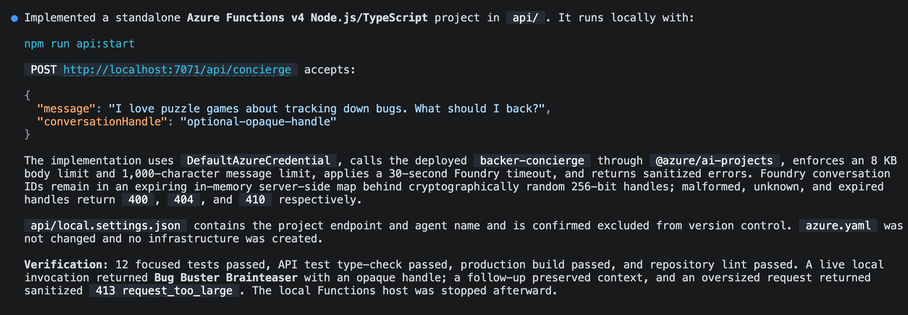
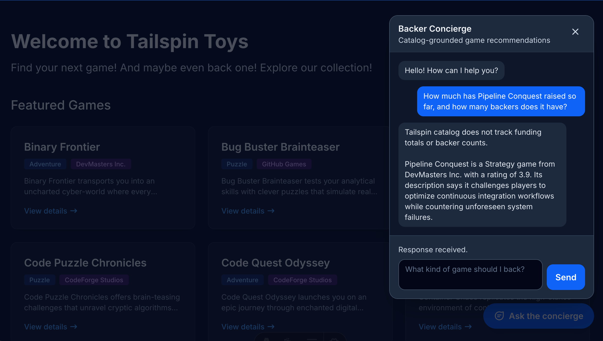

[모듈 2][previous-lesson]에서는 Backer Concierge를 배포하고 테스트했습니다. [선택 사항 컨시어지 시리즈][overview]의 마지막 모듈에서는 로컬 Tailspin Toys 웹사이트에서 해당 에이전트를 사용할 수 있도록 합니다.

이 모듈에서는 다음을 수행합니다.

- Foundry 자격 증명을 서버에만 유지하는 로컬 Azure Functions 프록시(Proxy)를 빌드합니다.
- 사이트에 접근성을 갖춘 채팅 위젯을 추가합니다.
- 전체 대화 흐름을 검증하고 리소스를 정리합니다.

## 시나리오

후원자는 개발자 터미널이나 Azure Portal이 아니라 Tailspin Toys 웹사이트에서 게임을 찾습니다. 팀은 카탈로그와 함께 컨시어지(Concierge)를 제공하면서 후속 질문을 지원하고 서비스 자격 증명을 보호하는 채팅 경험을 구현하려고 합니다.

## 호스트된 에이전트에서 계속하기

웹사이트 통합에는 모듈 2에서 배포한 에이전트가 필요합니다. 프록시와 웹사이트는 로컬에서 실행하고, 에이전트는 Foundry에서 계속 실행 상태로 유지합니다.

1. Tailspin Toys 리포지토리의 `foundry-agent-cli` 브랜치와 기존 Copilot CLI 세션으로 돌아갑니다.
2. Backer Concierge가 배포되어 있고 [에이전트 빌드 및 배포하기][previous-lesson]의 원격 호출이 성공했는지 확인합니다. Azure 리소스를 이미 제거했다면 계속 진행하기 전에 이전 모듈을 따라 다시 만듭니다.

> [!IMPORTANT]
> 이 모듈의 프록시와 웹사이트는 로컬에서 실행합니다. 프로덕션 웹사이트 배포가 아닙니다. 모델과 호스트된 에이전트(Hosted agent)는 [정리][cleanup]를 완료할 때까지 요금이 부과되는 Azure 리소스로 남아 있습니다.

## 서버 측 프록시 빌드하기

Tailspin Toys는 전체를 사전 렌더링합니다. 브라우저 코드는 호스트된 에이전트를 직접 호출하거나 Foundry 자격 증명을 받아서는 안 됩니다. Foundry에 인증하고 에이전트 응답만 브라우저에 반환하는 로컬 Azure Functions **서버 측 자격 증명 경계**를 추가합니다.

`microsoft-foundry` 스킬은 호스트된 에이전트 작업 흐름을 담당하며, 같은 플러그인에 포함된 더 폭넓은 Azure 스킬은 로컬 Function 프로젝트를 준비할 수 있습니다. 이러한 스킬로 프록시를 빌드한 뒤 자격 증명을 노출하지 않고 에이전트에 연결하는지 확인합니다.

1. Copilot CLI에 다음을 입력합니다.

    ```text
    Use the Azure skills to add an Azure Functions v4 Node.js and TypeScript project in api with one POST /api/concierge endpoint that invokes my deployed Backer Concierge hosted agent. This Function will run locally only; don't add it to azure.yaml or create Azure deployment infrastructure. Use DefaultAzureCredential with my local Azure sign-in. Keep the HTTP trigger thin, isolate the Foundry client in a unit-testable module, validate and limit request bodies, set explicit timeouts, and return sanitized errors. Store the Foundry project endpoint and agent name in local server-side settings that are excluded from version control. Never return credentials or access tokens to the browser. The Astro site is `output: 'static'` with no dev proxy, so also add a local-only Vite dev-server proxy for /api to the Function's port in astro.config.mjs, so relative /api/concierge requests reach it during `astro dev`.

    For conversation state, generate a high-entropy handle on the server, map it to the Foundry conversation server-side with an expiration, and never expose a raw Foundry conversation or thread identifier. Reject malformed, expired, and unknown handles. Add focused unit tests.
    ```

    

2. 다른 터미널을 열고 Copilot이 제공한 명령으로 로컬 Function을 시작합니다. Function을 실행 상태로 둡니다.
3. Copilot CLI로 돌아가 로컬 프록시 테스트를 요청합니다.

    ```text
    Send a request to the local /api/concierge endpoint asking "Which games are under $30?" and show me the sanitized JSON response. Confirm that the request reaches the deployed Backer Concierge through DefaultAzureCredential.
    ```

4. 응답을 살펴봅니다. 카탈로그에 가격 정보가 없다고 설명해야 합니다. Foundry 토큰, 자격 증명, 프로젝트 엔드포인트, 원본 Foundry 대화 식별자, 스택 추적이 포함되어서는 안 됩니다.

    

## 채팅 위젯 빌드하기

프록시를 통해 브라우저가 안전하게 컨시어지에 연결할 수 있게 되었습니다. 이제 사이트에 채팅 위젯을 추가하고 Playwright로 전체 대화 흐름을 확인합니다.

1. Copilot에 사이트 통합을 요청합니다.

    ```text
    Add an accessible Backer Concierge chat widget as an Astro component and render it site-wide from Layout.astro. It should POST to /api/concierge and thread the conversation using the returned opaque conversation handle, follow the dark theme in style.instructions.md, support Escape to close, and include data-testid attributes.
    ```

2. 로컬 Function을 실행 상태로 유지한 채 다른 터미널에서 Copilot이 제공한 명령으로 Astro 사이트를 시작합니다.
3. Copilot CLI로 돌아갑니다. [연습 4][playwright-lesson]에서 추가한 Playwright MCP 서버를 이미 사용할 수 있습니다. Copilot에 위젯 테스트를 요청합니다.

    ```text
    Use the Playwright MCP server to test the Backer Concierge widget end to end in the running Tailspin Toys site. Verify its core chat flow, conversation continuity, accessibility, error handling, grounding boundaries, and secure use of the local proxy. Report the results and include evidence for any failures.
    ```

    

4. 보고된 증거와 결과를 대조해 검토합니다. 실패한 검사가 있다면 마무리하기 전에 Copilot에 해당 프록시나 위젯 동작을 수정하고 실패한 검사를 다시 실행하도록 요청합니다.

## 리소스 정리하기

로컬 웹사이트에서 작동하는 컨시어지라는 최종 결과물을 완성했습니다. 공통 정리 지침은 시리즈 전반에서 만든 로컬 서비스와 Azure 리소스를 모두 다룹니다.

1. [리소스 정리하기][cleanup]를 완료합니다. 로컬 서비스를 중지하고 Azure 리소스 삭제가 완료되었는지 확인하는 작업도 포함됩니다.

## 요약 및 다음 단계

로컬 서버 측 프록시와 접근성을 갖춘 채팅 위젯을 통해 호스트된 Backer Concierge를 Tailspin Toys에 연결했습니다. 시리즈 전반에서 GitHub Copilot CLI와 Foundry를 사용해 모델을 준비하고, 에이전트를 빌드 및 배포한 뒤 완전한 웹사이트 통합을 검증했습니다.

CLI 워크숍을 마무리하려면 [검토 및 다음 단계][review]로 이동합니다.

[overview]: ../
[previous-lesson]: ../2-build-and-deploy/
[review]: ../../9-review/
[playwright-lesson]: ../../4-mcp/
[cleanup]: ../#리소스-정리하기
