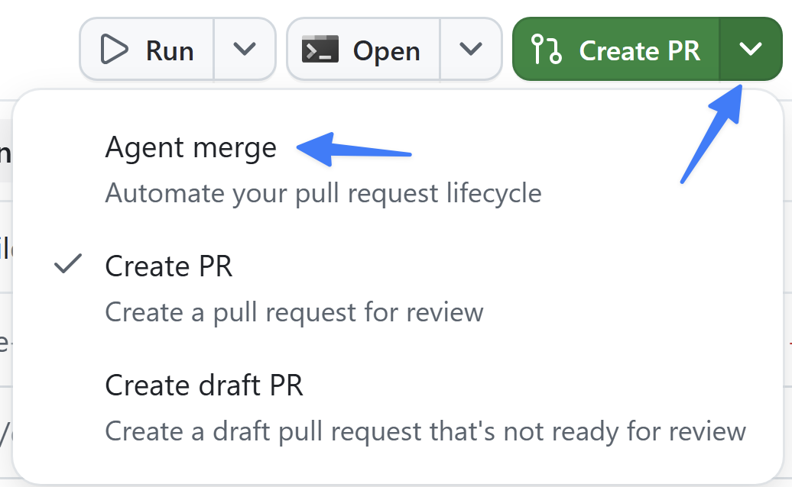

Até agora, você orientou agentes pelo chat. No entanto, grande parte do trabalho não acontece em uma conversa, mas em um quadro, documento ou checklist. Os **canvases** oferecem a você e ao agente uma superfície compartilhada exatamente para esse tipo de trabalho, dentro do aplicativo. Nesta lição, você criará um canvas simples para planejar e acompanhar o backlog no qual vem trabalhando.

Nesta lição, você vai:

- entender o que é um canvas e quando usá-lo.
- criar um canvas compartilhado de quadro Kanban para fazer a triagem do backlog.
- salvar o canvas no repositório e integrá-lo para a equipe.
- abrir o canvas em uma nova sessão e começar a trabalhar a partir dele.

## Cenário

Analisar uma lista de issues pode ser uma tarefa desafiadora, mesmo nas melhores condições. As pessoas desenvolvedoras da Tailspin Toys procuram uma ferramenta que permita fazer rapidamente a triagem de issues e começar a trabalhar nelas no aplicativo Copilot.

## O que é um canvas?

Um [canvas][canvas-docs] é uma superfície interativa e compartilhada para um artefato de trabalho, como um plano, um quadro de triagem, um checklist de lançamento, um painel ou um documento. Embora o chat seja ótimo para descrever intenções e analisar ambiguidades, a maior parte do trabalho acontece em uma *superfície*. Os canvases permitem colaborar com o agente diretamente nessa superfície.

Os canvases são **bidirecionais**: o agente pode atualizar o canvas enquanto trabalha, e você pode editar a mesma superfície. Quando você cria um canvas, o agente o desenvolve com base no prompt e no fluxo de trabalho. Você pode pedir que ele adicione, remova ou revise recursos durante o processo. Depois de criado, o canvas é aberto no painel direito do aplicativo.

Alguns exemplos comuns incluem:

- **Canvases Markdown** para planejar o dia e priorizar issues e pull requests.
- **Quadros Kanban agênticos** nos quais pessoas e agentes adicionam cards e movem o trabalho entre colunas.
- **Quadros de triagem de issues** que resumem as principais issues e os temas recorrentes de um repositório.

## Por que usar um canvas?

Use um canvas quando uma tarefa exigir estrutura, iteração e verificação e o chat não for suficiente. Um canvas permite:

- fundamentar o trabalho do agente em um artefato real adequado ao seu fluxo de trabalho.
- orientar ou corrigir o trabalho diretamente na superfície compartilhada e depois permitir que o agente continue a partir das suas alterações.
- acompanhar o progresso como alterações visíveis em um artefato, e não apenas como respostas no chat.

## Criar um canvas para acompanhar o trabalho

Você já entregou muitos recursos: a avaliação por estrelas, o padrão de documentação e o recurso de filtragem foram integrados. No entanto, ainda há itens no backlog. Vamos criar um canvas para ajudar a fazer rapidamente a triagem do trabalho.

1. Volte ao aplicativo GitHub Copilot ou abra-o.
2. Selecione **Home screen**.
3. Verifique se `tailspin-toys` está selecionado como repositório.
4. Na caixa de prompt, use o prompt a seguir para criar um canvas que atenda às nossas necessidades:

   ```plaintext
   Create a basic Kanban board canvas that allows me to quickly triage work. Highlight the three issues which are most likely to need attention right now, with the remainder in a second section down below. The top three cards should include a description of the issue's content and a justification of why they're at the top of the list. Each issue should have a button that allows me to add it to the current context for the current session so I can get to work on it straightaway.
   ```

O Copilot começará a criar o canvas.

> [!NOTE]
> A criação levará alguns minutos. Como essa é uma tarefa complexa, talvez a primeira versão não atenda a todas as suas expectativas. Você pode continuar enviando prompts para criar a ferramenta ideal para suas necessidades.

## Salvar o canvas e integrá-lo ao repositório

Os canvases podem se tornar ativos do repositório, assim como arquivos de instruções e skills. Vamos pedir ao Copilot que adicione o canvas ao repositório e faça o merge para que toda a equipe possa usá-lo.

1. Na mesma sessão, peça ao Copilot que salve o canvas no repositório usando o prompt a seguir:

   ```plaintext
   Let's save this canvas definition to the repository so I can share it with my development team
   ```

2. Depois que o Copilot salvar os arquivos do canvas, selecione o menu suspenso ao lado de **Create PR** no canto superior direito.
3. Selecione **Agent merge** para habilitá-lo.

   

4. O texto do botão mudará para **Agent merge**.
5. Selecione o botão **Agent merge** para iniciar o processo.

O aplicativo Copilot começará a criar e gerenciar o PR. Primeiro, ele explora o projeto para determinar a melhor maneira de criar um PR e depois cria o pull request.

Após alguns instantes, você verá que o Copilot voltou a trabalhar, agora analisando as condições do PR, incluindo o processo de CI que executa todos os testes do repositório. Ele informará o status das revisões deixadas por outras pessoas da equipe, das verificações que precisam ser executadas e da possibilidade de fazer o merge do PR.

6. Permita que o Agent Merge faça o merge do pull request selecionando o menu suspenso ao lado de **Agent merge** e depois **Merge pull request**.

   

7. Aguarde até que todos os processos de CI sejam concluídos com êxito e fiquem verdes. Quando isso acontecer, o Copilot fará o merge do pull request automaticamente.

Você criou um novo canvas compartilhado para a equipe.

## Trabalhar no canvas

Com o canvas criado, vamos iniciar uma nova sessão e usá-lo.

1. No aplicativo Copilot, inicie uma nova sessão selecionando **New session** ao lado de **tailspin-toys**.
2. Peça ao Copilot que abra o canvas de triagem usando o prompt a seguir:

   ```plaintext
   Open the triage issues canvas
   ```

3. O canvas criado será aberto nessa nova sessão.
4. Selecione **Add to current context** em uma das issues que mais lhe interessam.
5. O Copilot começará a trabalhar na issue.

Você usou um canvas criado por você para otimizar o processo de desenvolvimento.

## Resumo e próximos passos

Você criou uma superfície compartilhada na qual você e o agente podem colaborar. Você:

- aprendeu o que são canvases e quando usá-los.
- criou com o agente um canvas compartilhado de quadro Kanban para triagem.
- salvou o canvas no repositório e fez o merge dele com o Agent Merge.
- abriu o canvas em uma nova sessão e o usou para começar a trabalhar.

Com o acompanhamento do backlog configurado, continue para [revisar o que você criou][next-lesson]. Para uma extensão opcional usando o Microsoft Foundry Canvas, explore [Opcional: Incorporar o Foundry][foundry-canvas].

## Recursos

- [Trabalhar com extensões de canvas no aplicativo GitHub Copilot][canvas-docs]
- [Canvases no Awesome Copilot][awesome-copilot-canvases]
- [Sobre o aplicativo GitHub Copilot][about-copilot-app]

[next-lesson]: ../9-review/
[foundry-canvas]: ../8-foundry-canvas/
[canvas-docs]: https://docs.github.com/copilot/how-tos/github-copilot-app/working-with-canvas-extensions
[awesome-copilot-canvases]: https://awesome-copilot.github.com/extensions/
[about-copilot-app]: https://docs.github.com/copilot/concepts/agents/github-copilot-app