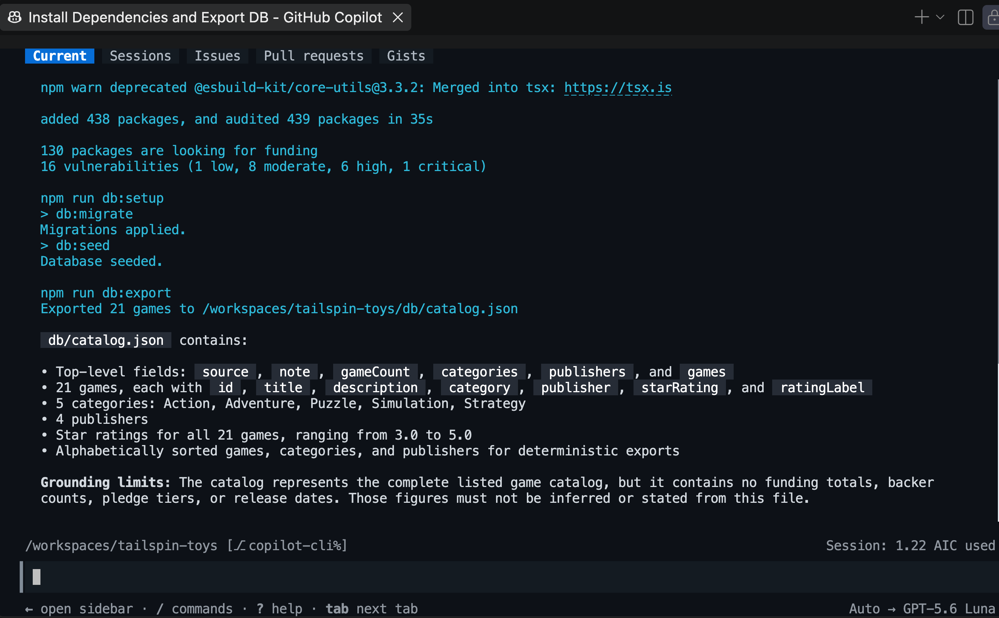
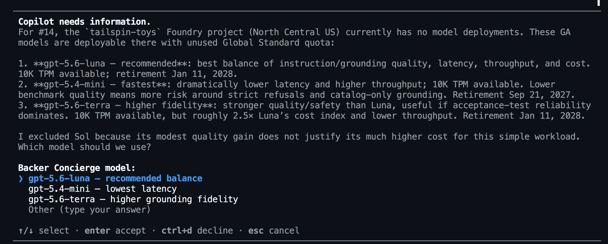
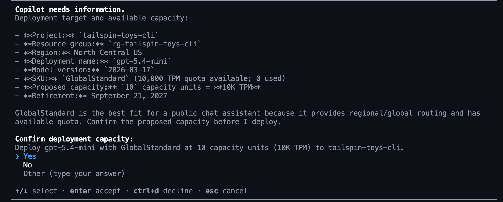

Este é o primeiro módulo de [Opcional: Incorpore o Foundry][overview]. Você preparará as ferramentas e o catálogo e, em seguida, usará o Copilot para criar um projeto do Foundry e testar um modelo implantado antes de criar o agente.

Neste módulo, você vai:

- instalar as ferramentas de linha de comando do Azure e o plugin Azure Skills.
- exportar o catálogo e planejar o trabalho com o Foundry.
- selecionar, implantar e testar um modelo considerando os limites do catálogo.

## Cenário

O Tailspin Toys precisa de um concierge que saiba distinguir os fatos do catálogo das informações que a empresa não fornece. Uma recomendação útil pode indicar um jogo de quebra-cabeça bem avaliado, mas não pode inventar o total arrecadado por esse jogo. Antes de investir em um assistente completo, a equipe quer ter confiança de que o modelo escolhido consegue respeitar esse limite.

## Pré-requisitos e configuração

Você usará o Azure para hospedar o Backer Concierge e o Copilot CLI para orientar o trabalho. Primeiro, prepare as ferramentas de linha de comando e o plugin que permitem ao Copilot trabalhar com seus recursos do Azure.

> [!IMPORTANT]
> As [instruções de limpeza][cleanup] cobrem tanto a interrupção após este módulo quanto a conclusão da série.

1. Confirme que você tem uma assinatura do Azure. Se precisar de uma, as opções disponíveis incluem uma [assinatura gratuita do Azure com US$ 200 em créditos][azure-free] ou o [Azure for Students com US$ 100 em créditos][azure-students].
2. Volte ao codespace do Tailspin Toys e abra um terminal.
3. Instale a CLI do Azure no contêiner de desenvolvimento:

    ```bash
    curl -sL https://aka.ms/InstallAzureCLIDeb | sudo bash
    az version
    ```

4. Faça login na CLI do Azure com `az login` e confirme que está usando a assinatura correta com `az account show`.
5. Instale a [Azure Developer CLI][install-azd] versão 1.27.1 ou posterior. O Microsoft Foundry usa o `azd` para testar e implantar agentes hospedados.

    ```bash
    curl -sL https://aka.ms/install-azd.sh | bash
    azd version
    ```

6. Faça login na Azure Developer CLI com `azd auth login` e confirme que está usando a assinatura correta com `azd config show`.
7. Instale a extensão Foundry da Azure Developer CLI (azd):

    ```bash
    azd ext install microsoft.foundry
    ```

8. Abra uma nova sessão do Copilot CLI ao lado pela paleta de comandos. Pressione <kbd>Command</kbd>+<kbd>Shift</kbd>+<kbd>P</kbd> (Mac) ou <kbd>Ctrl</kbd>+<kbd>Shift</kbd>+<kbd>P</kbd> (Windows/Linux) e selecione **Chat: Nova sessão do Copilot CLI ao lado**.
9. Adicione o marketplace do Azure Skills. Você só precisa fazer isso na primeira instalação do plugin:

    ```text
    /plugin marketplace add microsoft/azure-skills
    ```

10. Instale o [plugin Azure Skills][azure-skills], que adiciona skills do Azure, o Azure MCP Server e o Foundry MCP Server ao GitHub Copilot CLI:

    ```text
    /plugin install azure@azure-skills
    ```

11. Confirme que o plugin configurou o servidor MCP do Azure:

    ```text
    /mcp list
    ```

12. Se as skills ou os servidores MCP não aparecerem, tente `/skills reload` ou `/restart` e verifique novamente.

As skills ensinam o fluxo de trabalho ao Copilot, enquanto os servidores MCP permitem que ele inspecione e trabalhe com seus recursos do Azure.

## Prepare sua branch de trabalho

Os exercícios anteriores podem ter criado e enviado outras branches de funcionalidade. Você começará esta série opcional a partir de uma branch `main` atualizada para manter o trabalho do agente separado.

1. No terminal do shell, mude para `main`, baixe as alterações mais recentes e crie uma branch para o Backer Concierge:

    ```bash
    git checkout main
    git pull
    git checkout -b foundry-agent-cli
    ```

## Gere a exportação do catálogo

O agente precisa do catálogo em um arquivo que possa ler. O exemplo do Tailspin Toys inclui um script de exportação testado para essa finalidade.

1. Volte ao Copilot CLI e insira:

    ```text
    Install the project dependencies, seed the database, then run the existing db:export script. Show me the command output and summarize the shape and grounding limits of db/catalog.json.
    ```

    O Copilot deve executar o equivalente a:

    ```bash
    npm install
    npm run db:setup
    npm run db:export
    ```

    

2. Abra `db/catalog.json`. Confirme que ele contém 21 jogos com título, descrição, categoria, editora e avaliação em estrelas. O campo `note` informa que o catálogo não contém totais arrecadados, quantidades de apoiadores, níveis de apoio ou datas de lançamento. Também não há campos de preço, número de jogadores ou tempo de jogo. Essas ausências definem o limite que o agente deve respeitar.

## Planeje o trabalho com o Foundry

Antes de o Copilot criar recursos do Azure ou adicionar código do agente, você usará o modo plan para tornar visível o fluxo de trabalho pretendido.

1. Insira o seguinte prompt:

    ```text
    /plan Use the Microsoft Foundry Skill to plan a Backer Concierge hosted agent for this existing Tailspin Toys repository. Use a public Foundry project, Python 3.13, Microsoft Agent Framework, the Responses API, the Basic sample, and code deployment. Keep the agent in agent/backer-concierge and keep one azure.yaml at the repository root. Ground every answer in db/catalog.json, preserve conversation context, and add focused tests. Include project setup, model selection, local testing, deployment, remote invocation, estimated cost-bearing resources and cleanup.
    ```

2. Revise o plano proposto. Confirme que o Copilot pretende usar a skill `microsoft-foundry` e que separa o agente hospedado do aplicativo Astro existente. Se notar algo preocupante ou inesperado, solicite revisões antes de prosseguir.
3. Saia do modo plan quando estiver satisfeito com a abordagem.

## Configure um projeto e um modelo do Foundry

O agente precisa de um projeto do Foundry e de um modelo implantado. Você usará a skill do Microsoft Foundry para selecioná-los com base na disponibilidade e na cota atuais da sua assinatura.

1. Peça ao Copilot para criar o projeto. Antes de aprovar a criação de recursos, verifique a assinatura, a região, a cota e o custo estimado selecionados:

    ```text
    Use the Microsoft Foundry Skill to create a public Foundry project for this project. Use the resource group rg-tailspin-toys and project name tailspin-toys.
    ```

    

2. Quando o projeto estiver pronto, peça ao Copilot para recomendar um modelo:

    ```text
    Use the Microsoft Foundry Skill to recommend two or three current chat models available in the tailspin-toys project for the Backer Concierge acceptance criteria in the issue titled "Add a Backer Concierge assistant for catalog questions". Prioritize low latency, instruction following, grounding fidelity, available quota, and models that aren't approaching retirement. There is no complex math or multi-step planning. Explain the tradeoffs and wait for me to choose a model from the recommended options.
    ```

    O Copilot pode solicitar que você selecione um modelo entre as opções recomendadas.

    

    Continuaremos com `gpt-5.4-mini` nas próximas etapas, mas a disponibilidade e a cota variam por região.

3. Selecione um modelo entre as opções recomendadas e peça ao Copilot para implantar sua escolha. Revise a capacidade e o custo antes de aprovar a implantação:

    ```text
    Deploy the model we selected to the tailspin-toys Foundry project and use the model name as the deployment name. Choose an SKU with available quota, ask me to confirm the capacity before deployment. After deployment, show me the deployment status.
    ```

    

> [!TIP]
> A disponibilidade dos modelos muda ao longo do tempo. A escolha certa é um modelo cuja disponibilidade no projeto seja confirmada pelo Copilot, não um modelo fixado em um exemplo.

## Teste o modelo implantado

Antes de criar o agente hospedado, você testará se o modelo segue as regras do Backer Concierge para fundamentar as respostas. Esse teste usa as instruções pretendidas e o contexto do catálogo, sem nenhum código ou configuração de agente.

Primeiro, você atribuirá à conta conectada a função **Foundry Project Manager** para desenvolver o agente hospedado no Módulo 2 e a função **Cognitive Services OpenAI User** para inferência direta do modelo. Depois, fará uma pergunta sobre o catálogo que também solicita informações ausentes nele.

1. Abra um novo terminal e defina os valores da conta, do projeto e do usuário. Substitua `<foundry-account-name>` pelo nome da conta do Foundry informado quando o projeto foi criado:

    ```bash
    SUBSCRIPTION_ID=$(az account show --query id --output tsv)
    USER_OBJECT_ID=$(az ad signed-in-user show --query id --output tsv)
    FOUNDRY_ACCOUNT="<foundry-account-name>"
    ACCOUNT_SCOPE=$(az cognitiveservices account show --name "$FOUNDRY_ACCOUNT" --resource-group rg-tailspin-toys --query id --output tsv)
    PROJECT_SCOPE="$ACCOUNT_SCOPE/projects/tailspin-toys"
    ```

2. Atribua a função **Foundry Project Manager**:

    ```bash
    az role assignment create \
       --assignee-object-id "$USER_OBJECT_ID" \
       --assignee-principal-type User \
       --role "Foundry Project Manager" \
       --scope "$PROJECT_SCOPE" \
       --subscription "$SUBSCRIPTION_ID"
    ```

3. Atribua a função **Cognitive Services OpenAI User**:

    ```bash
    az role assignment create \
       --assignee-object-id "$USER_OBJECT_ID" \
       --assignee-principal-type User \
       --role "Cognitive Services OpenAI User" \
       --scope "$ACCOUNT_SCOPE" \
       --subscription "$SUBSCRIPTION_ID"
    ```

4. Volte ao Copilot CLI e insira:

    ```text
    Use the Microsoft Foundry Skill to test my deployed model directly in the tailspin-toys project without creating an agent. Ground it with content from @db/catalog.json and ask: "I love puzzle games about tracking down bugs. What should I back, and how much funding has it raised?" Show me the response and useful metadata like tokens used and response time (only if you can obtain it). Do not change files or create resources.
    ```

    

5. Revise a resposta. Ela deve recomendar apenas um jogo real do catálogo, usar os detalhes corretos do catálogo e explicar que as informações de arrecadação não estão disponíveis. Se o modelo inventar um título, detalhes do jogo ou um total arrecadado, compare outro modelo recomendado antes de continuar.

> [!NOTE]
> Isso testa apenas o modelo implantado com instruções temporárias e contexto do catálogo. Não testa um agente. O Módulo 2 repete o teste após a geração da estrutura para validar o código, o empacotamento e o comportamento de conversação do agente hospedado.

## Resumo e próximos passos

Você preparou as ferramentas do Azure, exportou o catálogo e testou um modelo implantado com base nas regras do Backer Concierge para fundamentar as respostas. O resultado deste módulo é um modelo que recomenda jogos reais do catálogo sem inventar informações ausentes.

A seguir, você usará o mesmo repositório, a branch `foundry-agent-cli`, a sessão do Copilot CLI, o projeto do Foundry e a implantação do modelo selecionado para [criar e implantar o agente][next-lesson]. Se for parar por aqui, [limpe seus recursos do Azure][cleanup] para evitar custos contínuos.

[overview]: ../
[next-lesson]: ../2-build-and-deploy/
[cleanup]: ../#limpe-seus-recursos
[azure-free]: https://azure.microsoft.com/pricing/purchase-options/azure-account
[azure-students]: https://azure.microsoft.com/free/students
[install-azd]: https://learn.microsoft.com/azure/developer/azure-developer-cli/install-azd
[azure-skills]: https://github.com/microsoft/azure-skills#github-copilot-cli
