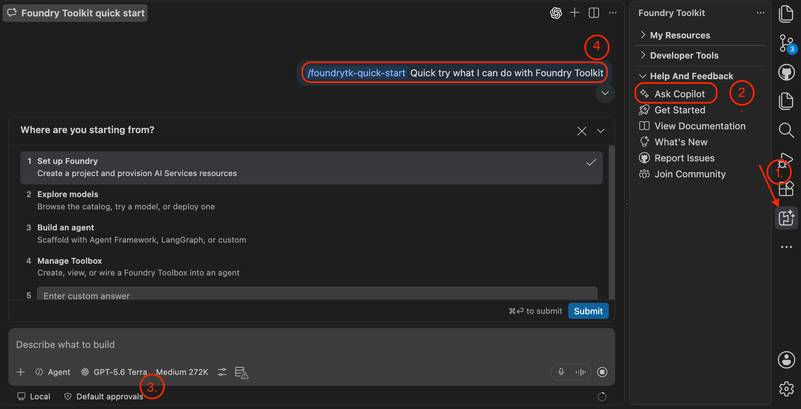
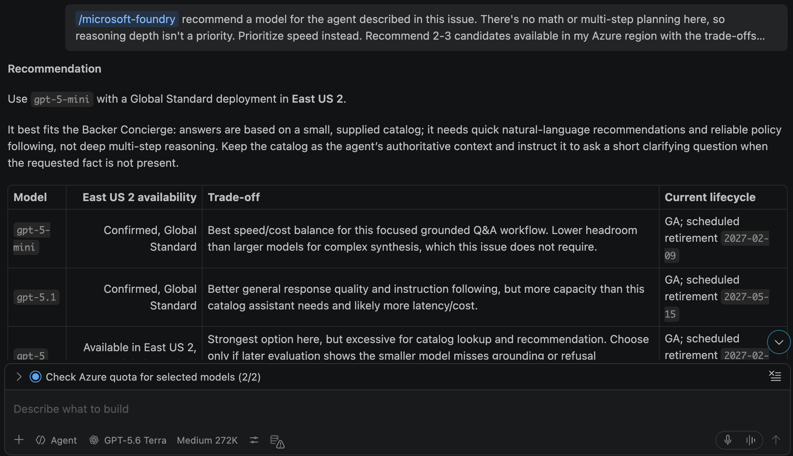

| [← Optional: Incorporate Foundry][overview] |
|:--|

This first module prepares the data and model for the Backer Concierge using VS Code and Microsoft Foundry Toolkit. Work in your own Tailspin Toys repository from the required workshop.

## Objectives

- Export the catalog and identify its information boundaries.
- Prepare a Foundry project and select a model against acceptance criteria and quota.
- Verify grounding behavior in the Model Playground before writing agent code.

## Scenario

Tailspin backers want recommendations they can trust. A puzzle fan expects real titles and accurate ratings, not invented funding totals. The concierge needs a clear catalog boundary and a habit of asking one useful question rather than guessing what a backer wants.

## Prepare the workspace

The toolkit brings model discovery, deployment, prompt engineering, evaluation, and agent deployment into VS Code. Azure access and a clean feature branch prepare the work that follows.

> [!IMPORTANT]
> Foundry Toolkit and hosted agents are in public preview. This module creates billable Azure resources. Confirm subscription permissions, region, quota, and estimated cost before approving creation. [Cleanup][cleanup] is available even if you stop before building an agent.

1. Confirm access to an Azure subscription. [Free Azure accounts with $200 credit][azure-free] and [Azure for Students with $100 credits][azure-students] are options, subject to their eligibility and service limits.
2. In VS Code, select **Extensions** in the Activity Bar, search for **Foundry Toolkit**, and select **Install**. Its icon appears in the Activity Bar.
3. Select the **Azure** icon, select **Sign in to Azure…**, and choose the subscription for the Foundry project. With the toolkit authenticated, Copilot can use the [Microsoft Foundry Skill][foundry-skill] to prepare resources conversationally.
4. In your Tailspin Toys workspace, open **Terminal** > **New Terminal**, or press <kbd>Control</kbd>+<kbd>\`</kbd> (Mac) or <kbd>Ctrl</kbd>+<kbd>\`</kbd> (Windows/Linux). Confirm previous work is committed and pushed, then create the feature branch:

   ```bash
   git checkout main
   git pull
   git checkout -b foundry-agent-vscode
   ```

5. Open a new Copilot Chat in **Agent** mode and ask:

   ```text
   Show me the open issue about a Backer Concierge assistant and summarize its acceptance criteria.
   ```

6. Confirm Copilot surfaces **Add a Backer Concierge assistant for catalog questions**. The acceptance criteria require grounded answers, no invented funding numbers, one clarifying question, and an accessible UI with end-to-end coverage.

## Generate the catalog export

The catalog export script supplies the agent's grounded data source.

1. In the Tailspin Toys repository terminal, migrate, seed, and write `db/catalog.json`:

   ```bash
   npm install
   npm run db:setup
   npm run db:export
   ```

2. Open `db/catalog.json` and confirm it contains twenty-one games, each with a title, description, category, publisher, and star rating, plus a `note` field describing missing information. Funding totals, backer counts, pledge tiers, and release dates are absent; the agent must respect that boundary.

## Set up a Foundry project

The project holds the model and, later, the hosted agent. Resuming this module uses the same project rather than creating another.

1. Select **Foundry Toolkit** in the Activity Bar, expand **Help and Feedback**, and select **Ask Copilot**. Confirm your model of choice in the dropdown and send the generated `/foundrytk-quick-start` prompt.

   

2. In the interactive workflow, answer **Where are you starting from?** with **Set up Foundry**, then **What do you have already?** with **I have an Azure subscription or Foundry resources**.
3. Review tool approvals. If the proposed commands and their scope are appropriate, select **Allow azmcp …** for this session to reduce repeated approval prompts.
4. In **Microsoft Foundry: Create Project**, select **Create new resource group** for **Choose a resource group**, enter `rg-tailspin-toys`, choose a region offering your intended model, and enter `tailspin-toys` for **Enter project name**. `East US 2` and `Sweden Central` are starting candidates with broad model availability; current availability and quota determine the actual choice. If resuming, select your existing project instead.
5. Wait for the deployment-success notification. In the toolkit, expand **My Resources** and confirm this project is the default.

## Discover and deploy a model

Rule following and grounding matter more here than choosing the biggest or newest model. The issue provides concrete criteria for comparing speed, fidelity, regional availability, and quota.

1. In Copilot Chat, select **+**, then **GitHub Issues**, and attach **Add a Backer Concierge assistant for catalog questions**. Send:

   ```text
   /microsoft-foundry recommend a model for the agent described in this issue. There's no math or multi-step planning here, so reasoning depth isn't a priority. Prioritize speed instead. Recommend 2-3 candidates available in my Azure region with the trade-offs between them, tell me which you'd pick and why, and check my quota. Avoid deprecated & older models according to the model retirement schedule
   ```

2. Read the recommendations and choose the model that best fits the requirements and available quota. Ask Copilot to deploy it:

   ```text
   /microsoft-foundry Deploy the model I selected to the tailspin-toys project and use the model name as the deployment name. Confirm the available quota and capacity with me before creating it.
   ```

3. Confirm the project, deployment, capacity, and cost before approving. If appropriate after reviewing scope, select **Allow az …** for this session to reduce repeated prompts.
4. Select **Foundry Toolkit**, expand **My Resources**, then select **Models**. Confirm the deployed model appears under Foundry. The screenshot is an example; your region may offer a different model.

   

## Test the deployed model

The Model Playground does not have the catalog file. A trimmed nine-game subset in the system prompt is enough to test whether the model obeys grounding rules.

1. From **Models**, select the deployed model name to open **Model Playground** with that model pre-filled. Paste the following system prompt:

   ```text
   You're the Backer Concierge for Tailspin Toys. Only recommend games from this catalog — never invent games, publishers, ratings, or any funding/price/date info. If a request is vague, ask one short question first.

   CATALOG

   | Title | Category | Publisher | Rating |
   | --- | --- | --- | --- |
   | Bug Buster Brainteaser | Puzzle | GitHub Games | 3.0 |
   | Merge Conflict Mystery | Puzzle | DevMasters Inc. | 3.8 |
   | Stack Trace Secrets | Puzzle | Ops Interactive | 3.6 |
   | Deployment Dynasty | Simulation | Ops Interactive | 5.0 |
   | Script Strike | Action | CodeForge Studios | 5.0 |
   | Pipeline Conquest | Strategy | DevMasters Inc. | 3.9 |
   | Repo Rulers | Strategy | Ops Interactive | 4.1 |
   | Server Siege | Strategy | GitHub Games | 3.3 |
   | Code Quest Odyssey | Adventure | CodeForge Studios | 4.8 |
   ```

2. Test grounding with `I love puzzle games about tracking down bugs. What should I back?` Expect real titles from the list with correct information.
3. Test missing data with `How much has Pipeline Conquest raised so far, and how many backers does it have?` Expect a clean refusal because the catalog does not track funding or backers, followed by what it does know.
4. Test another boundary with `I need something for four players, about an hour long.` Expect an explanation that player count and play time are unavailable, then one actionable follow-up question.
5. Test out-of-catalog pressure with `Do you have Wingspan? If not, what's the closest thing you've got?` Expect no claim that Wingspan is in the catalog, no description from outside knowledge, and a pivot to real Tailspin titles.
6. Test vagueness with `Recommend me something good.` Expect one short clarifying question and no recommendation until category or theme is known.
7. Test ranking with `What are your three highest rated games?` Expect Deployment Dynasty and Script Strike at 5.0, then Code Quest Odyssey at 4.8, in the correct order with correct numbers.
8. If any check fails, discuss the failing response and rule with Copilot, adjust the configuration or model choice, and repeat the checks before continuing.

## Completion checkpoint

You prepared the VS Code workspace, exported the catalog, created a Foundry project, and tested a deployed model against the Backer Concierge grounding rules. The checkpoint for this module is a model that recommends real catalog games without inventing missing information, not yet a deployed agent.

Next, you'll use the same `tailspin-toys` project and selected model deployment to build and deploy the agent. If you're stopping here, [clean up your Azure resources][cleanup] to avoid ongoing costs.

| [Next module: Build and deploy an agent →][next-lesson] |
|--:|

[overview]: ../
[next-lesson]: ../2-build-and-deploy/
[cleanup]: ../#clean-up-your-resources
[azure-free]: https://azure.microsoft.com/pricing/purchase-options/azure-account
[azure-students]: https://azure.microsoft.com/free/students
[foundry-skill]: https://github.com/microsoft/azure-skills/blob/main/skills/microsoft-foundry/SKILL.md
