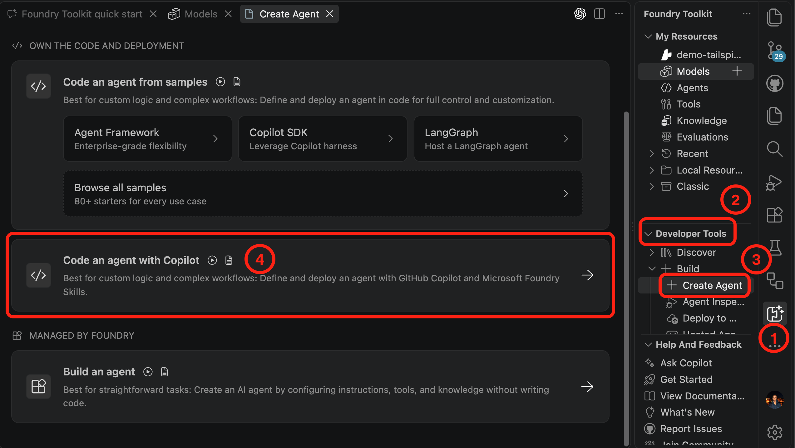
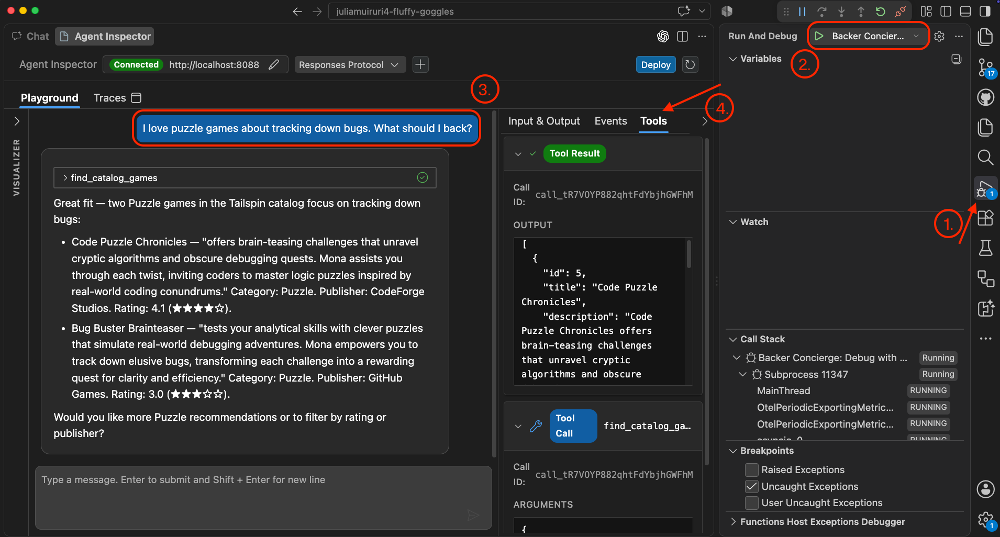
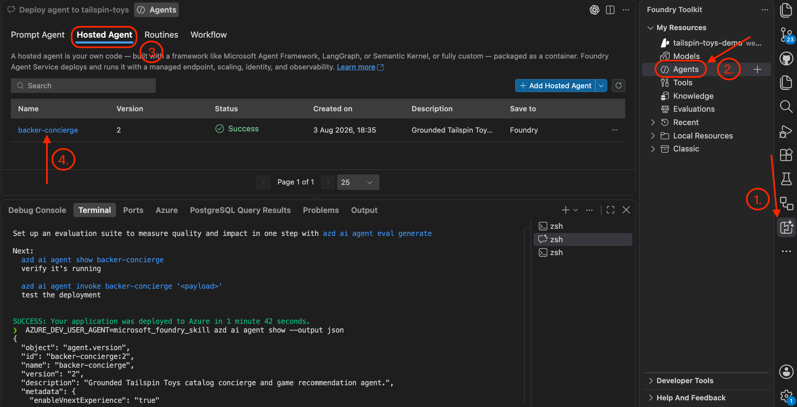

| [← Previous module: Prepare a project and model][previous-lesson] |
|:--|

This module uses the catalog and tested model from [Prepare a project and model][previous-lesson]. Microsoft Foundry Toolkit and its **AIAgentExpert** custom agent guide the local build and hosted deployment in VS Code.

## Objectives

- Scaffold a catalog-grounded agent in the existing Tailspin Toys workspace.
- Debug local behavior with Agent Inspector.
- Deploy to the existing Foundry project and verify the hosted agent.

## Scenario

A trustworthy recommendation must survive more than a single conversation. Tailspin Toys needs the concierge to keep its catalog boundaries when backers ask vague questions or press for unavailable funding details. A hosted concierge should behave just as reliably as one tested privately.

## Resume the workspace

The agent uses the existing model deployment; there is no new Foundry project to create.

1. Open the same Tailspin Toys repository in VS Code on `foundry-agent-vscode`. Confirm `db/catalog.json` exists and the project `tailspin-toys` and tested model deployment are visible under **Foundry Toolkit** > **My Resources**.
2. Confirm the [previous checkpoint][previous-lesson] is complete. If resources were cleaned up, complete the project/model preparation again before proceeding.
3. Install Azure Developer CLI (`azd`) if it is not already available. Hosted-agent deployment uses it; choose only the command for your operating system:

   ```bash
   # macOS / Linux
   curl -fsSL https://aka.ms/install-azd.sh | bash

   # Windows (PowerShell)
   winget install microsoft.azd
   ```

4. Sign in to the subscription used for the existing project:

   ```bash
   azd auth login
   ```

> [!IMPORTANT]
> Hosted agents and Foundry Toolkit are in public preview. Deployment creates billable resources. Confirm subscription, permissions, region, quota, and estimated cost before approving commands.

## Create and debug the agent

The toolkit scaffolds code in the current repository and opens a specialized Copilot Chat. Agent Inspector makes local requests, events, and tool calls visible before deployment.

1. Select **Foundry Toolkit**, expand **Developer Tools**, expand **+ Build**, and select **+ Create Agent**. On **Create Agent**, select **Code an agent with Copilot**.

   

2. In the new chat, confirm it switches to **AIAgentExpert**. Replace the generated prompt with the customized prompt and submit it:

   ```text
   /foundrytk-quick-start Create a backer concierge AI agent called 'Backer Concierge'. The agent should use the model I deployed to answer catalog questions and recommend games grounded strictly in db/catalog.json. Review the acceptance criteria in the issue titled 'Add a Backer Concierge assistant for catalog questions' and ensure the agent meets them. Generate the code into agent/backer-concierge in the current workspace and ask me if anything is unclear.
   ```

3. Review the generated code under `agent/backer-concierge`. Confirm the catalog is included in the deployable agent, focused tests pass, and no credentials or local environment files will be committed.
4. Select **Run and Debug** in the Activity Bar and start the debugger with <kbd>F5</kbd>. Confirm **Agent Inspector** loads and connects to the agent server.
5. Reuse all six prompts from [Test the deployed model][model-tests]. Check answers against the full `db/catalog.json`, rather than assuming the nine-game subset's ranking is the full catalog ranking.
6. Switch between **Input & Output**, **Events**, and **Tools** to inspect payloads, session events, and tool calls. If behavior violates the acceptance criteria, ask Copilot to fix it and rerun focused tests and Inspector checks before deploying.

   

## Deploy and test the hosted agent

The **Go production** handoff packages the existing agent for Foundry. It does not make the later site proxy a production-ready public service.

1. In the agent-creation Copilot Chat, select **Go production**, replace the default prompt with the following, and submit it:

   ```text
   /foundrytk-quick-start Review this agent for deployment readiness, run its tests, then deploy it to my existing tailspin-toys Foundry project. Show me the deployment status and test the deployed agent.
   ```

   

2. Review the chat and terminal for parameters and command approvals. Confirm deployment targets the existing `tailspin-toys` project and review billable resources before approving.
3. If Copilot offers an evaluation suite, optionally accept and work through it as an additional check.
4. Select **Foundry Toolkit**, expand **My Resources**, and select **Agents**. On the **Agents** tab, switch to **Hosted Agent**.

   

5. Select the agent name and confirm deployment status is **Running**. Switch to **Playground** and repeat the grounding, missing-data, out-of-catalog, vagueness, and ranking checks against the deployed catalog.

   

6. If deployment or responses fail, inspect the reported status and logs with Copilot, correct the failure in the existing project, and repeat the checks. Do not proceed with an unverified deployment.

## Completion checkpoint

You scaffolded the Backer Concierge, debugged its catalog grounding in Agent Inspector, deployed it to Foundry through the **Go production** handoff, and retested the hosted version in the Playground. The checkpoint for this module is a running hosted agent that respects the catalog without inventing missing information.

Next, you'll use the same `tailspin-toys` project, model deployment, and hosted agent to connect the agent to the site. If you're stopping here, [clean up your Azure resources][cleanup] to avoid ongoing costs.

| [Next module: Connect the agent to the site →][next-lesson] |
|--:|

[previous-lesson]: ../1-project-and-model/
[model-tests]: ../1-project-and-model/#test-the-deployed-model
[next-lesson]: ../3-connect-to-site/
[cleanup]: ../#clean-up-your-resources
