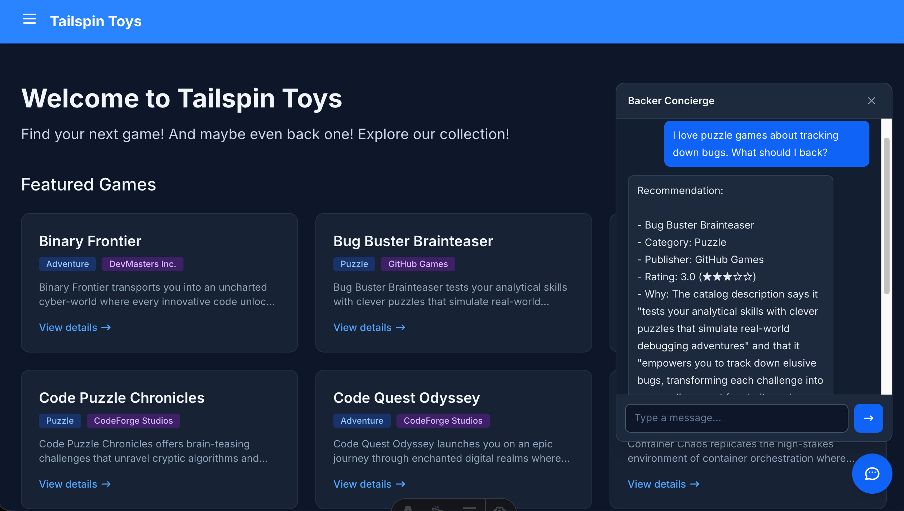

| [← Previous module: Build and deploy an agent][previous-lesson] |
|:--|

This module connects the hosted agent from [Build and deploy an agent][previous-lesson] to Tailspin Toys. Copilot Chat in VS Code creates a local integration, not a public production endpoint.

## Objectives

- Keep credentials and Foundry conversation identifiers behind a local server-side proxy.
- Add an accessible chat widget with conversation continuity.
- Verify the backend and full experience before cleaning up resources.

## Scenario

Backers should be able to ask the concierge for advice without leaving the catalog. A conversation needs to retain context, work with a keyboard, and protect private connection details. Trust depends on both honest recommendations and a safe, accessible experience.

## Resume the workspace

The existing hosted agent is the integration target. Tailspin Toys is a fully pre-rendered static website, so browser code cannot securely hold the agent's credentials.

1. Open the same Tailspin Toys repository on `foundry-agent-vscode` in VS Code. Confirm the hosted agent from the previous checkpoint is still **Running** in the existing `tailspin-toys` project and that your local Azure sign-in targets its subscription.
2. Open Copilot Chat in regular **Agent** mode instead of **AIAgentExpert**. Attach **Add a Backer Concierge assistant for catalog questions** by selecting **+**, then **GitHub Issues**, and choosing the issue.

## Build and verify the local proxy

A local Azure Functions proxy in `/api` holds connection details and forwards requests while the site runs locally. Copilot can use **Azure skills** to prepare and validate it.

> [!IMPORTANT]
> This workshop proxy is for local development only. Do not deploy it as an anonymous public endpoint. Production needs application-specific authentication and abuse controls, including rate limits or quotas, CORS restrictions, monitoring, and cost controls.

1. Ask Copilot to create the proxy:

   ```text
   Add a local Azure Functions proxy in api for the static Astro site to call my deployed Backer Concierge securely during development. Use my existing local Azure sign-in to call the hosted agent, keep all credentials out of the browser, protect conversation state with opaque handles, validate requests, sanitize errors, add focused tests, and configure the Astro dev server so /api requests reach the local Function. Don't create public deployment infrastructure.
   ```

2. Review changes before accepting them. Confirm credentials and Foundry conversation identifiers stay on the server, local settings are excluded from version control, requests are bounded, and focused tests pass.
3. Prove the backend works before building UI:

   ```text
   Start the local Functions host and test /api/concierge by asking "Which games are under $30?" Show me the sanitized response and confirm that no credentials or internal conversation identifiers are returned.
   ```

4. Check the terminal response. Expect valid JSON with a `response` property containing the answer, no invented price information, and no credentials or internal conversation identifiers. If a check fails, ask Copilot to fix it and repeat the backend test.
5. **Keep** the changes and use **/clear** to start fresh for the widget in the same repository and branch. Retain the local proxy configuration and existing hosted-agent connection.

## Build and test the widget

The UI now has a verified backend. End-to-end tests check both usability and the catalog's information boundaries.

1. Ask Copilot to add the widget:

   ```text
   Add an accessible Backer Concierge chat widget to the Astro site. Connect it to /api/concierge, preserve the conversation using the returned opaque handle, follow the existing design guidance, support keyboard use, and make it testable.
   ```

   

2. Keep the Function and site running, then verify the complete experience:

   ```text
   Use Playwright MCP to test the Backer Concierge widget end to end. Verify the core chat flow, conversation continuity, keyboard and accessibility behavior, grounding boundaries, and safe use of the local proxy. Report the results and fix any failures.
   ```

3. Review the test results and changes against the issue acceptance criteria: grounded answers, no invented funding numbers, one clarifying question, accessible UI, and end-to-end coverage. Confirm failures are fixed and the affected checks rerun.

## Completion checkpoint

You built a local credential-safe proxy, connected an accessible chat widget, and verified the full conversation flow against the hosted Backer Concierge. The checkpoint for this module is a locally tested site integration that preserves the catalog boundary and keeps credentials and internal Foundry identifiers out of the browser. It is not a production deployment of the proxy or site.

When you're finished experimenting, stop the local services and [clean up your Azure resources][cleanup] to avoid ongoing costs. Then return to the [VS Code overview][vscode-overview] on the core workshop.

[previous-lesson]: ../2-build-and-deploy/
[cleanup]: ../#clean-up-your-resources
[vscode-overview]: ../../
