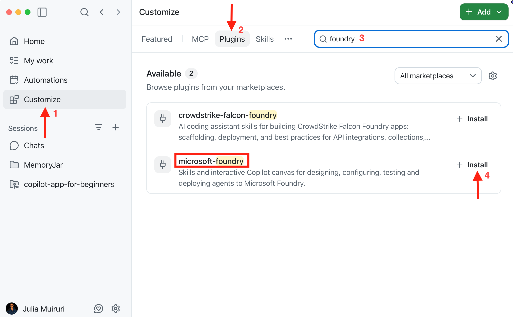
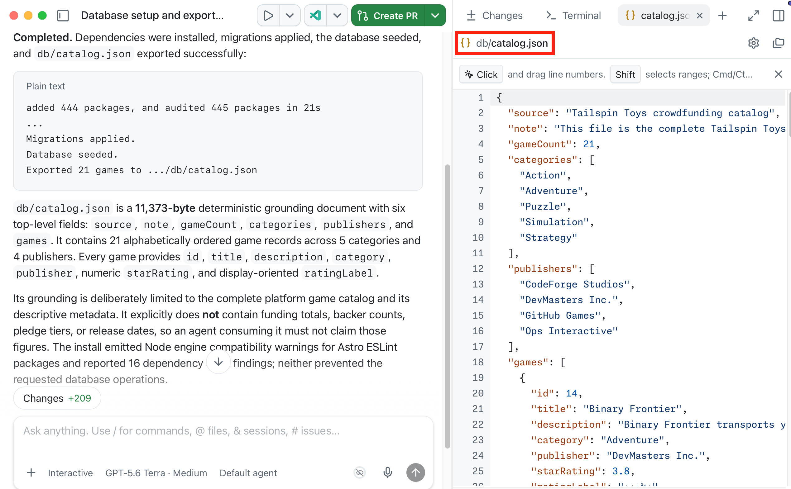
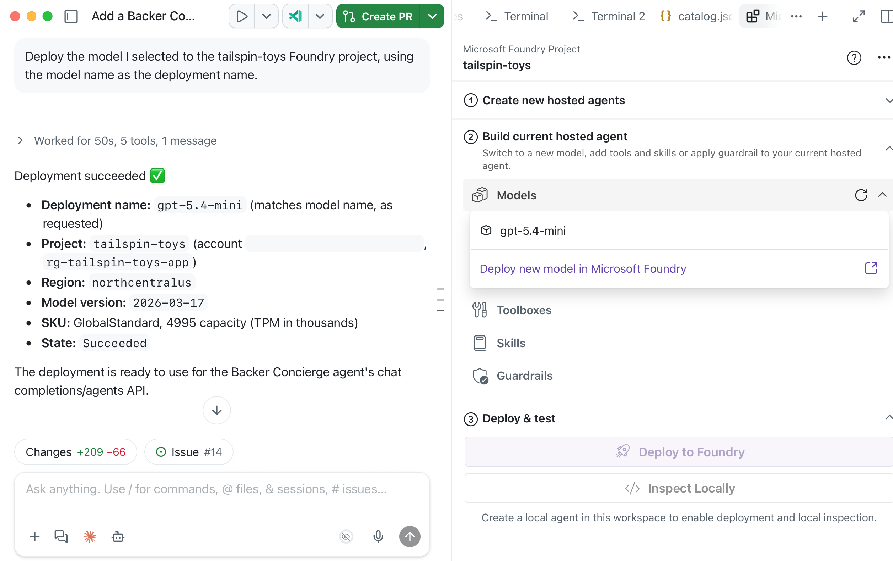

第一个模块将准备 Backer Concierge 所需的数据和 Azure 资源。目前尚不需要代理代码或托管部署。

完成本模块后，将获得：

- 一份明确限定回答依据范围的目录导出文件。
- 一个 Foundry 项目，以及根据功能要求选定的模型部署。
- 一个经 Canvas 验证的部署，以及一次限定在目录范围内的简单模型冒烟测试结果。

## 场景

Tailspin Toys 的支持者可以按类别和发行商筛选游戏，但*哪些游戏适合喜欢 Git 双关语的人？*这类问题无法通过下拉选项解答。Backer Concierge 应只推荐 Tailspin 目录中的游戏，绝不能编造游戏、发行商、评分、筹款总额、支持者人数、价格、玩家人数、游戏时长或发布日期。可靠的目录和合适的模型是这些回答的基础。

## 准备工具和议题会话

此设置将 GitHub Copilot app 连接到 Azure，同时把所有功能开发工作集中在一起。

1. 确认拥有 Azure 订阅。如果需要订阅，可选择[含 200 美元额度的免费 Azure 订阅][azure-free]或[含 100 美元额度的 Azure for Students][azure-students]。
2. 安装适用于当前操作系统的 [Azure CLI][install-azure-cli]，然后使用 `az version` 验证安装。
3. 安装 [Azure Developer CLI][install-azd]，然后使用 `azd version` 验证已安装 1.27.1 或更高版本。
4. 打开 GitHub Copilot app，打开 **Customize**，然后选择 **Plugins**。搜索 `microsoft-foundry`，为 Microsoft Foundry 插件选择 **Install**。该插件包含 Canvas 和 Foundry 技能。

   

5. 在 **Customize** 中选择 **Plugins**，搜索 `azure` 或从 **Featured** 列表中选择它，然后为 Azure 插件选择 **Install**。
6. 在 **My work** 选项卡中，找到并打开 Tailspin Toys 存储库中标题为 **Add a Backer Concierge assistant for catalog questions** 的议题。选择 **New session**，在新工作树中启动关联该议题的会话。三个模块均使用此存储库、工作树分支和议题会话。
7. 输入 `/microsoft-foundry`，然后输入 `/azure`，确认两个技能均已安装且可用；暂时不要发送任何提示词。如果插件未立即出现，请重启应用，返回同一个议题会话并再次检查。

## 生成目录导出文件

示例存储库包含一个导出脚本，可为代理生成能够读取的文件。

8. 在这个关联议题的工作树会话中，将提示框内默认的 `/fix-issue` 提示词替换为：

   ```plaintext
   Install the project dependencies, seed the database, then run the existing db:export script. Show me the command output and summarize the shape and grounding limits of db/catalog.json.
   ```

9. 查看命令输出。Copilot 应运行与以下内容等效的命令：

   ```bash
   npm install
   npm run db:setup
   npm run db:export
   ```

   

10. 打开 `db/catalog.json`，确认其中包含 21 款游戏，每款游戏都有标题、描述、类别、发行商和星级评分。检查其 `note` 字段：目录不包含筹款总额、支持者人数、支持档位或发布日期。对于缺失的价格、玩家人数和游戏时长，也应视为不可用信息，而不是用外部知识填补空白。如果导出失败或内容不符，请先要求 Copilot 调查并重新运行，再继续。

   

## 设置 Foundry 项目和模型

先在聊天中创建项目和部署，可确保 Canvas 只连接到已存在的资源。

11. 选择 **+**，选择 **Terminal**，然后登录 Azure：

    ```bash
    az login
    ```

12. 检查所选订阅并列出其中的资源组：

    ```bash
    az account show --output table
    az group list --output table
    ```

    如果订阅不正确，请运行 `az account set --subscription <subscription-id>`，然后重新运行这两个命令。

    如果出现 `rg-tailspin-toys`，请检查其中的资源：

    ```bash
    az resource list --resource-group rg-tailspin-toys --output table
    ```

    如果该组包含无关或共享资源，请先停止操作，选择专用名称后再使用以下提示词。请将后续所有提示词和命令中的示例名称替换为已批准的名称。
13. 在同一个议题会话中输入：

    ```plaintext
    Use the Microsoft Foundry skill to create a resource group named rg-tailspin-toys and a Foundry project named tailspin-toys.
    ```

    

14. 要求 Copilot 推荐模型。由于会话从议题启动，议题的验收标准已包含在上下文中：

    ```plaintext
    Use the Microsoft Foundry skill to recommend two or three current chat models in the tailspin-toys project that meet this issue's acceptance criteria. Explain the tradeoffs and wait for me to choose.
    ```

15. 确认 Copilot 加载了 `microsoft-foundry` 技能，然后根据各模型的优缺点选择一个可用模型。Microsoft Foundry 托管代理快速入门目前使用 `gpt-5.4-mini`，但可用性和配额因区域而异。

    

16. 要求 Copilot 部署所选模型，并在批准前审查目标项目和费用：

    ```plaintext
    Deploy the model I selected to the tailspin-toys Foundry project, using the model name as the deployment name.
    ```

> [!TIP]
> 模型的可用性会随时间变化。应选择 Copilot 确认在项目中可用的模型，而不是本模块中固定指定的某个模型。

## 在 Canvas 中验证模型并进行冒烟测试

此检查在尚无代理代码时验证项目和模型。模型冒烟测试不能替代模块 2 中验证托管代理回答是否以目录为依据的测试。

17. 选择 **+**，然后选择 **Canvas**，再选择 **Microsoft Foundry (Preview)**。
18. 打开 Canvas 右上角的 **More options** 菜单，然后选择 **Sign in**。
19. 选择 **tailspin-toys** Foundry 项目。展开 **Models**，确认部署已显示，且名称和状态符合预期。

    

20. 在同一会话中输入：

    ```plaintext
    使用 Microsoft Foundry 技能直接测试我在 tailspin-toys 项目中部署的模型，不要创建代理。根据 @db/catalog.json 中的内容回答以下问题：“我喜欢以追踪 bug 为主题的益智游戏。我应该支持哪个游戏？它筹集了多少资金？”显示回答，并且仅在可以获取时显示所用 token 数和响应时间等有用的元数据。使用我现有的 Azure 登录身份。不要显示凭据、修改文件或创建资源。
    ```

21. 检查回答。回答应仅推荐 `db/catalog.json` 中实际存在的游戏，使用正确的标题、发行商和评分，并说明没有可用的筹款信息。如果模型编造游戏、目录详情或筹款金额，请在继续之前比较另一个推荐模型。

> [!NOTE]
> 重新打开 Canvas 时，它会记住所选项目。其阶段包括：用于生成初始框架的 **Create new hosted agents**；用于连接模型、工具箱、技能和防护措施的 **Build current hosted agent**；以及用于本地运行和部署到 Microsoft Foundry 的 **Deploy and test**。

## 检查点与后续步骤

你已准备好 Azure 工具、导出目录，并根据 Backer Concierge 的依据规则测试了部署的模型。本模块的检查点是一个能够推荐目录中实际存在的游戏且不会编造缺失信息的模型。

接下来，你将使用同一个 Tailspin Toys 存储库、工作树分支、关联议题的会话、Foundry 项目和所选模型部署来[构建并部署代理][next-module]。如果在此停止，请[清理 Azure 资源][cleanup]以免继续产生费用。

[azure-free]: https://azure.microsoft.com/pricing/purchase-options/azure-account
[azure-students]: https://azure.microsoft.com/free/students
[install-azure-cli]: https://learn.microsoft.com/cli/azure/install-azure-cli
[install-azd]: https://learn.microsoft.com/azure/developer/azure-developer-cli/install-azd
[next-module]: ../2-build-and-deploy/
[cleanup]: ../#清理资源
