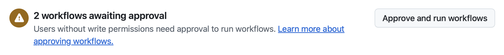

| [← 上一课：监控和管理代理][previous-lesson] |
| :-- |

## 审阅工作

在本实验中，已经与 GitHub Copilot 合作完成了多项改善用户体验的任务：使用代理模式在客户端和服务器端添加筛选功能，通过 Playwright MCP 服务器在浏览器中手动测试，再使用自定义代理实现高对比度和浅色模式切换等无障碍功能，并在会话进行中引导代理扩展工作。现在，该发布这些本地成果，并按照团队的方式进行审阅了。

### 场景

引入生成式 AI 并不会改变软件设计和 DevOps 的基本原则。Copilot 生成的任何成果仍然需要完整的审阅流程。因此，接下来将 codespace 中的无障碍更改推送到远程，创建拉取请求，并在邀请团队其他成员参与前逐项查看差异。
## 发布无障碍功能

在[练习 4][exercise-4] 和[练习 5][exercise-5] 中，使用无障碍自定义代理实现的高对比度和浅色模式切换功能，已作为提交保存在 codespace 中。接下来，将它们推送到分支并创建拉取请求，供其他团队成员审阅。

1. 返回 codespace。
2. 在 VS Code 中打开 **Source Control** 视图。
3. 确认无障碍更改已提交。如果练习 5 中还有未提交的更改，现在将其暂存并提交，使用描述性提交消息，例如 `Add high-contrast and light-mode toggles`。
4. 选择 **Publish Branch** 发布分支（或使用 **...** 菜单 → **Push**）。
5. VS Code 会提示在 github.com 上打开新分支。接受提示，或手动前往存储库，在分支横幅上选择 **Compare & pull request**。
6. 设置清晰的标题（例如 `Add high-contrast and light-mode toggles`），并用简短说明概括完成的工作及其原因。
7. 选择 **Create pull request**。
8. 拉取请求创建后，选择 **Files changed** 选项卡，完整审阅工作。重点关注：
   - 用于切换模式的 UI 组件。
   - 使用本地存储持久保存用户偏好的方式。
   - 高对比度和浅色模式的 CSS 或样式更改。
   - 无障碍属性（ARIA 标签、键盘导航等）。
   - 管理模式切换的 JavaScript/TypeScript 代码。

9. 返回 **Conversation** 选项卡。
10. 如果工作流正在等待批准，选择 **Approve and run workflows**。

    
11. 等待工作流完成。如果一切正常，所有工作流都应通过。

> [!TIP]
> 想为无障碍改进再获取一份意见？在拉取请求评论中提及 `@copilot`，并提出请求，例如“审查此拉取请求，找出其他 WCAG 问题”或“建议如何改进键盘导航”。Copilot 会启动新会话来处理这条评论。

## 可选练习 - 继续在本地探索

在 IDE 中与代理迭代协作是一项技能，只有反复练习才能掌握。以下是一些可从 VS Code 发起的后续会话思路：

- 在游戏详情页添加支持者意向表单。
- 在游戏列表页实现分页。
- 为 `src/lib/` 中的数据访问辅助函数添加输入验证和错误处理。
- 扩展无障碍代理的工作范围，例如审查整个网站的键盘焦点顺序。

## 总结

恭喜，已完成 VS Code 学习路径！通过本实验，已经：

- **使用 Playwright MCP 手动测试功能。** 添加 Playwright MCP 服务器，让 Copilot 操作浏览器验证筛选功能，然后再创建拉取请求。
- **使用代理模式协调全栈更改。** 在一个会话中添加了涉及客户端、服务器端和测试的筛选功能。
- **使用自定义代理。** 从代理选择器中选择专注于无障碍的自定义代理，观察它在存储库中实现高对比度模式。
- **管理并引导代理会话。** 在编辑器内审阅建议的更改，接受所需内容，并通过后续请求扩展会话，添加浅色模式。
- **通过拉取请求完成闭环。** 发布本地成果，并按照团队的方式进行完整审阅。

## 回顾与后续步骤

至此，VS Code 学习路径的必修部分已经结束。可以在这里停止，工作坊已完成。

如果想进一步了解 Copilot 的代理能力，其他学习路径会通过不同界面介绍相关场景：

- 💻 **[CLI 学习路径](../../cli/)** — 在终端中使用 Copilot CLI 完成类似流程：计划模式、代理技能、自定义代理，以及 `/share`、`/context` 和 `/delegate` 等斜杠命令。
- ☁️ **[云端代理学习路径](../../cloud/)** — 重点介绍将议题分配给云端代理、通过代理页面监控会话，以及在拉取请求上进行异步迭代。

也可以在已有成果上继续开发。[awesome-copilot][awesome-copilot] 提供了丰富的指令文件、自定义代理和技能，可根据自身项目需要加以调整。

作为可选扩展，[可选：集成 Foundry][exercise-7] 使用 VS Code 和 Microsoft Foundry Toolkit 准备模型、部署 Backer Concierge，并将其连接到网站。

## 资源

- [GitHub Copilot][github-copilot]
- [VS Code 中的 Copilot Chat][copilot-chat-vscode]
- [使用代理模式][agent-mode]

---

| [← 上一课：管理代理][previous-lesson] |
|:--|

[previous-lesson]: ../5-managing-agents/
[exercise-4]: ../4-custom-agents/
[exercise-5]: ../5-managing-agents/
[exercise-7]: ../7-foundry-toolkit/
[github-copilot]: https://github.com/features/copilot
[copilot-chat-vscode]: https://code.visualstudio.com/docs/copilot/chat/copilot-chat
[agent-mode]: https://code.visualstudio.com/docs/copilot/chat/chat-agent-mode
[awesome-copilot]: https://github.com/github/awesome-copilot
